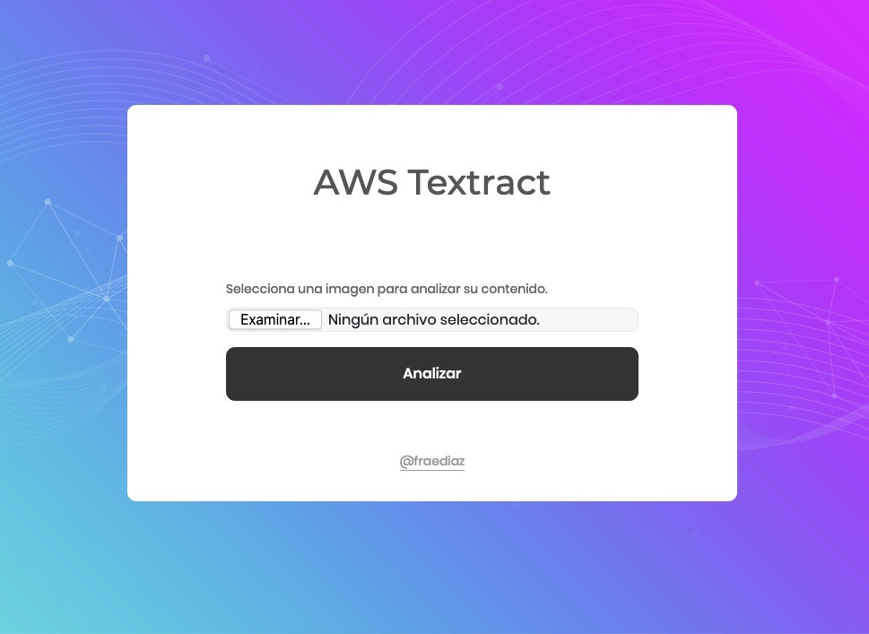

# Django AWS Textract

Proyecto de Inteligencia Artificial; utilizando herramientas de Amazon Web Services, el software puede identificar texto dentro de una imagen.




## Cómo comenzar ?

Necesitamos un entorno virtual basado Python 3.7, con él activo, instalamos las librerías.

```
 $: pip install -r librerias.txt
```

## Configuración AWS

Para que la magia funcione, debes tener configurado el acceso de usuario IAM en tu cuenta de AWS.
Se hace simplemente así:
```
 $: aws configure
```

## Levantar el proyecto
Aplicar migraciones y luego el comando de siempre
```
 $: python manage.py migrate
 $: python manage.py runserver 0:80
```

## Autor

* **Franco Díaz S.-**  *🐍 Python Developer* - [@fraediaz](https://github.com/fraediaz)
